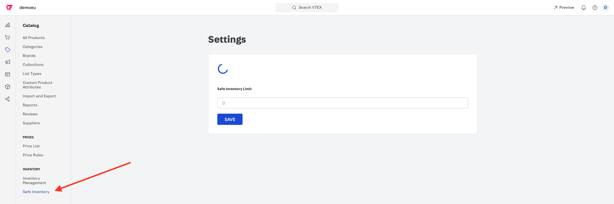
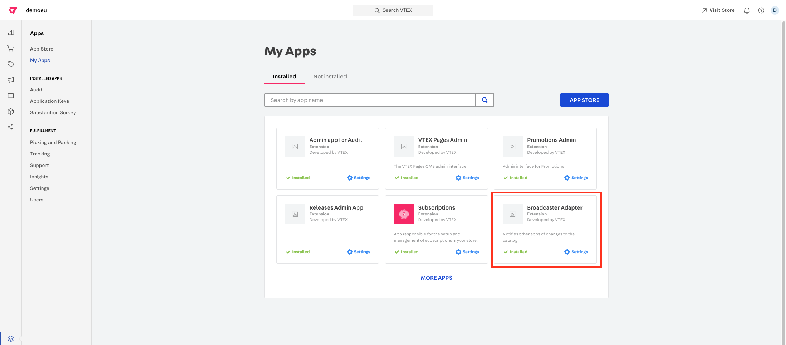
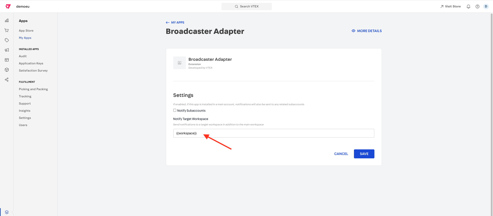
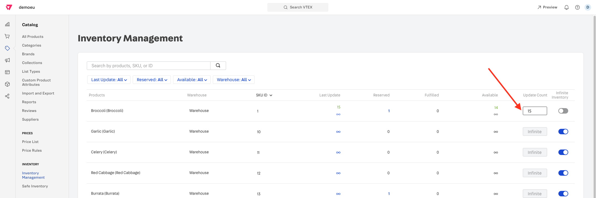
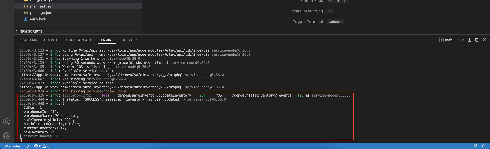

## Name:
Safe Inventory

## Description:
Example of a custom back-end application that listens to catalog changes and acts accordingly. When the stock level for an SKU changes and it's below a certain threshold which is configurable on the Admin panel, this application set the inventory to 0, otherwise, it leaves it untouched.

## Proof points:
- Back-end customization
- Admin extension
- External API calls
- GraphQL on VTEX IO
- Listening to events

## How to demo:

1. Clone/Download this repository and open it with a code editor of your choice, eg. VSCode

2. Open the terminal and login to your VTEX account

```
vtex login {{account}}
```

3. Create a new development workspace or use an existing one

```
vtex use {{workspace}}
```

4. Add the account name as the vendor on `manifest.json` file

```
{
  "name": "safe-inventory",
  "vendor": "{{account}}",
  "version": "0.0.1",
  "title": "Safe Inventory",
  "description": "Example of a custom back-end application that listens to catalog changes and acts accordingly.",
  "mustUpdateAt": "2018-01-04",
  ...
  ...
}
```

5. Link the project

```
vtex link
```

6. After the linking, open the admin panel and show that we extended it with a brand new section

```
Navigate to:

https://{{workspace}}--{{account}}.myvtex.com/admin/safeinventory

```



7. Input a value for the "Safe Inventory Limit", eg. 20

8. On the master workspace, set up the Catalog Broadcaster app in order to receive notifications on the workspace you are working on.




9. On the master workspace, edit the inventory for an existing SKU, eg. SKU 1 and quantity 15



10. While linking, show that the app get notified when there is a change to the inventory



11. If you added a stock below the "Safe Inventory Limit", the new stock should be set automatically to 0, otherwise, it should be left untouched
